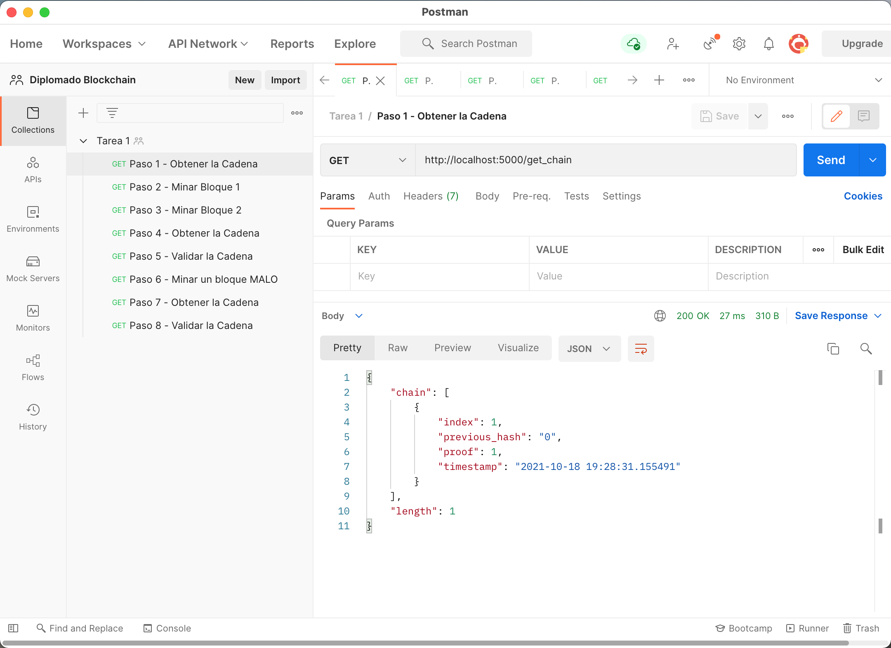
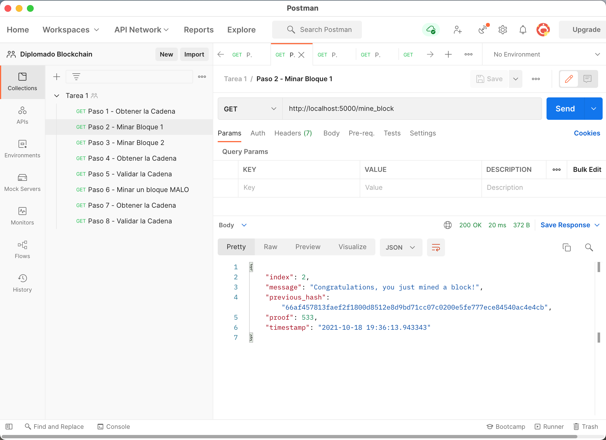
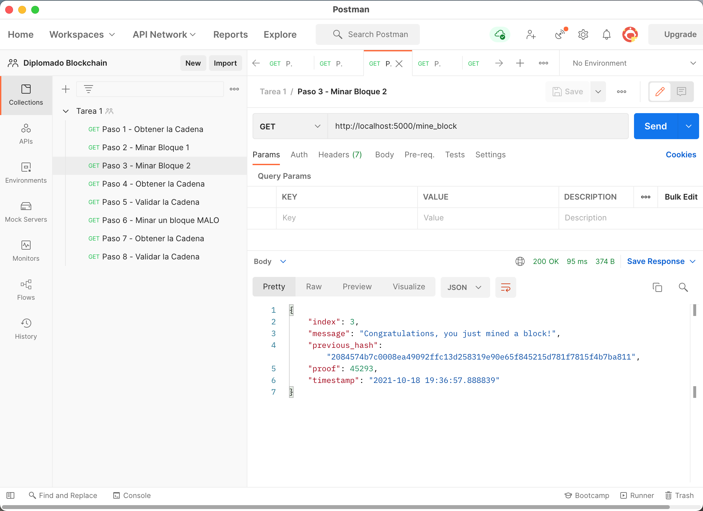
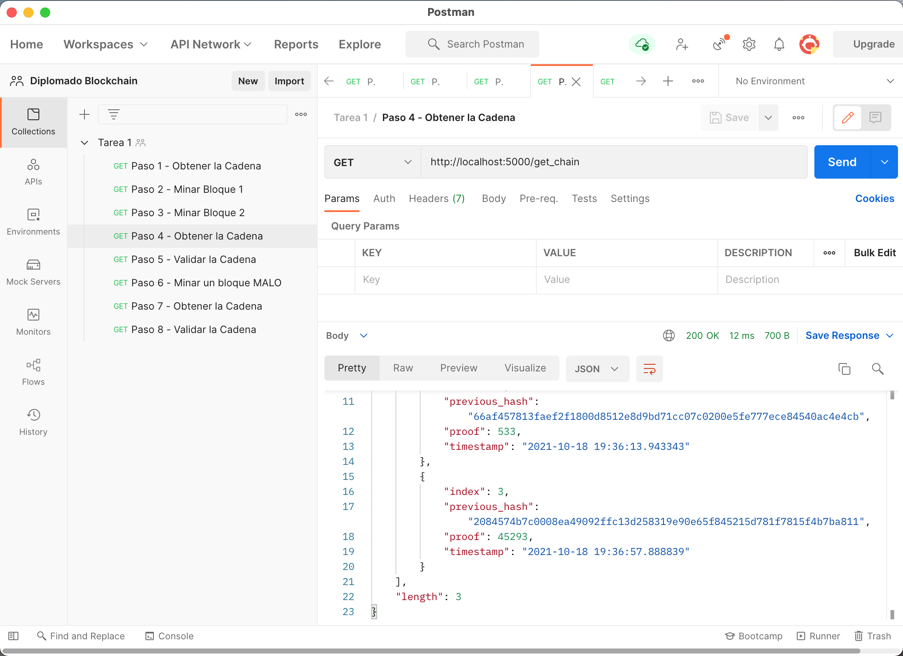
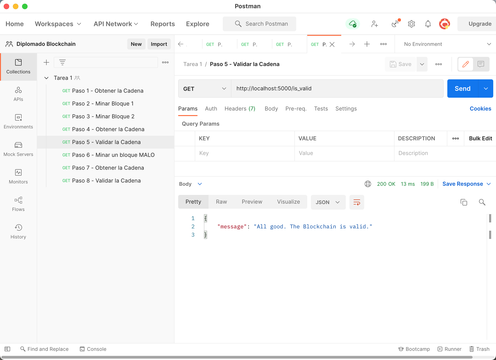
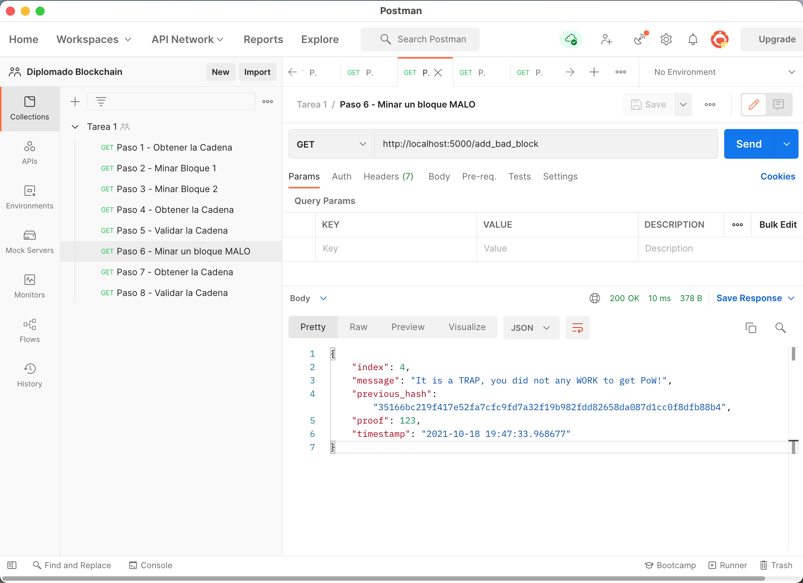
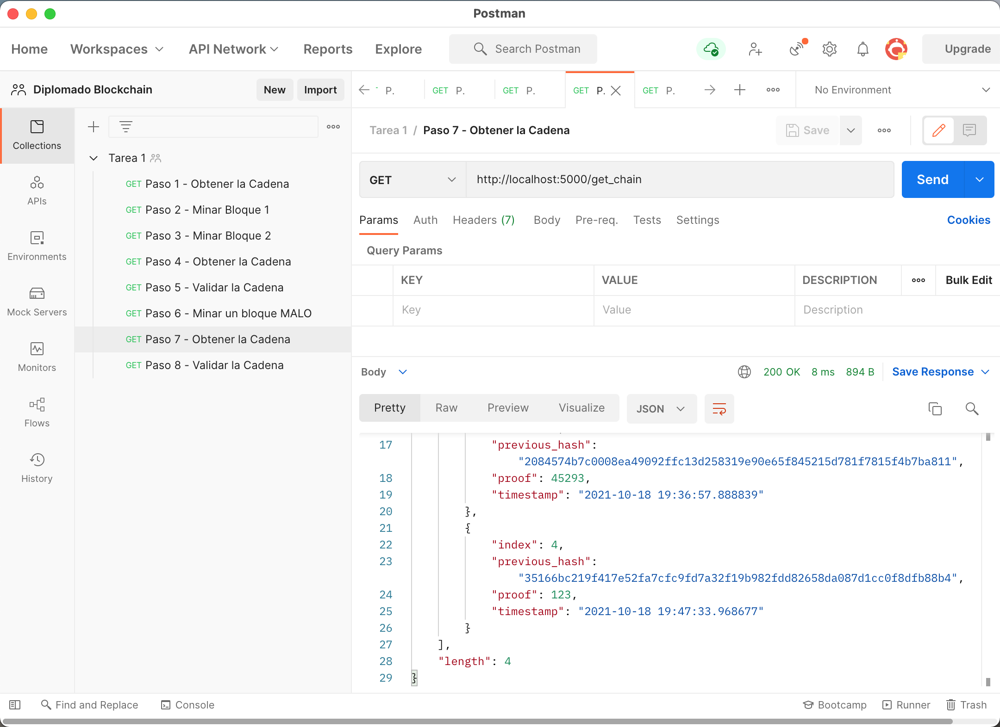
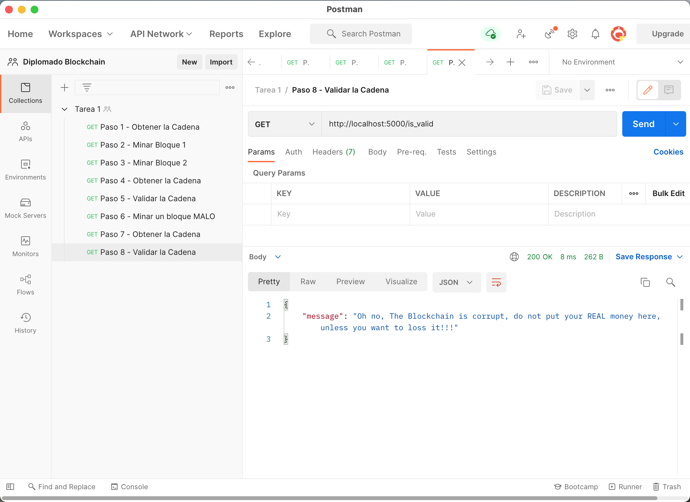

# Tarea 1 - Diplomado Blockchain

## Pasos para crear ambiente virtual
```bash
python3 -m venv venv --clear 
source venv/bin/activate
pip install --upgrade pip  
```

## Pasos para ejecutar el ejercicio

- Instalar dependencias Python 3

```bash
pip install -r requirements.txt
```

- Lanzar Flask (en modo Servidor de Desarrollo)

```bash
FLASK_DEBUG=true FLASK_APP=server:app flask run
```

## Pasos para probar el ejercicio desde terminal

- Lanzar las peticiones solicitadas, en nuevo terminal
```bash
source venv/bin/activate
source test.rest
```

## Pasos para probar el ejercicio desde Postman

- Utilizar las siguientes URL en orden:
    - http://localhost:5000/get_chain
    

    - http://localhost:5000/mine_block
    

    - http://localhost:5000/mine_block
    

    - http://localhost:5000/get_chain
    

    - http://localhost:5000/is_valid
    

    - http://localhost:5000/add_bad_block
    

    - http://localhost:5000/get_chain
    

    - http://localhost:5000/is_valid
    

- También se puede importar la colección Postman:
<a href="Tarea1.postman_collection.json">Colección Postman</a>
